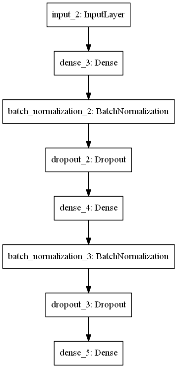

# Customer Segmentation Deep Learning
This project is a part of the assessment for SHRDC Data Science course

#### -- Project Status: [Completed]

## Project Intro/Objective
The purpose of this project is to produce a deep learning model to segmentate and predict customers based on features given

### Methods Used
* Inferential Statistics
* Deep Learning
* Data Visualization
* Predictive Modeling

### Technologies
* Python
* Pandas, Numpy, Sklearn
* Tensorflow
* Google Colaboratory

## Getting Started

1. Clone this repo (for help see this [tutorial](https://help.github.com/articles/cloning-a-repository/)).
2. Raw Data is being kept [(https://github.com/nkayfaith/customer_segmentation/tree/main/data)] within this repo.
    
3. Data processing/transformation scripts are being kept [https://github.com/nkayfaith/customer_segmentation/tree/main/model]

## Discussion, Analysis and Result
1. Model Architecture as follows:

2. Training processes recorded as follows:

3. Performance of the model and the reports as follows:

## Credits
https://www.kaggle.com/datasets/abisheksudarshan/customer-segmentation
