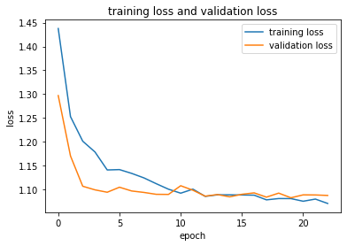
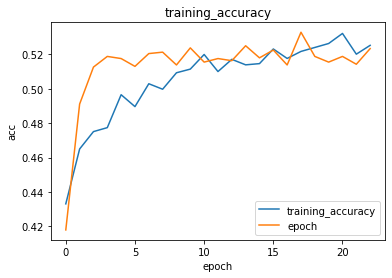
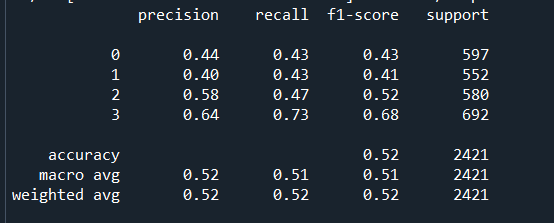

# Customer Segmentation Deep Learning
This project is a part of the assessment for SHRDC Data Science course

#### -- Project Status: [Completed]

## Project Intro/Objective
The purpose of this project is to produce a deep learning model to segmentate and predict customers segment based on features given

### Methods Used
* Inferential Statistics
* Deep Learning
* Data Visualization
* Predictive Modeling

### Technologies
* Python
* Pandas, Numpy, Sklearn
* Tensorflow

## Getting Started

1. Clone this repo (for help see this [tutorial](https://help.github.com/articles/cloning-a-repository/)).
2. Raw Data is being kept [(https://github.com/nkayfaith/customer_segmentation/tree/main/data)] within this repo.
    
3. Data processing/transformation scripts are being kept [https://github.com/nkayfaith/customer_segmentation/tree/main/model]

## Discussion, Analysis and Result
1. Model Architecture as follows:

A Sequential model with attributes of Dense = 256, Dropout = .3, Hidden Layer = 3, Epochs = 100 

2. Training processes recorded as follows:

Training loss and validation loss are both high, which indicates underfitting 

Accuracy recorded at 52%, which indicates a not-that reliable model

3. Performance of the model and the reports as follows:

Both F1 and Accuracy recorded at 

4. Enhancement suggested:
* Do feature selection
* Add more data, because model is underfitted
* Remove Dropout layer, because data is not sufficient
* Add more layer

## Credits
https://www.kaggle.com/datasets/abisheksudarshan/customer-segmentation
